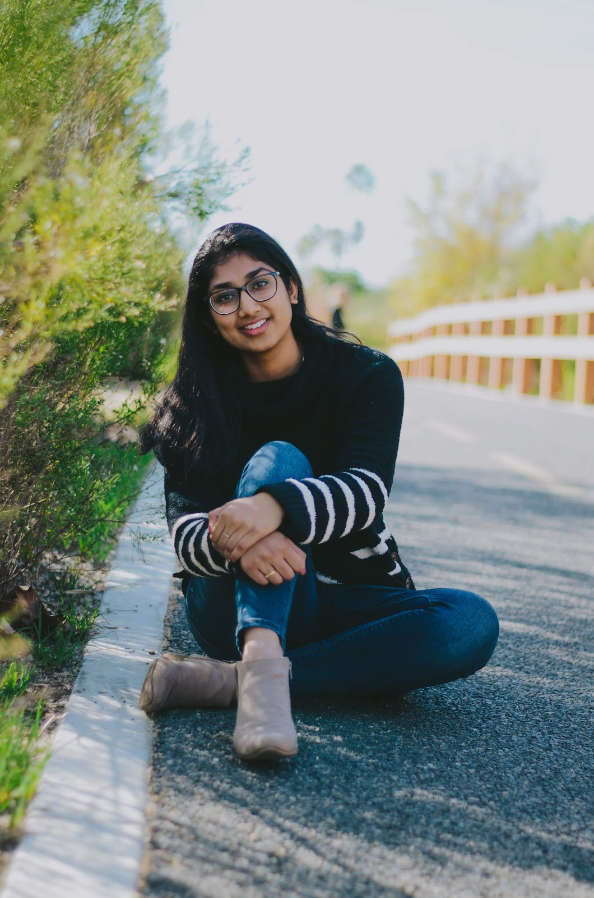

# **Welcome Y'all!** 
---
## Summary of Info:
- [Human Qualities](#human-qualities)
- [Tech Experience and Interest](#tech-qualities)
- [Other](#other)
  
---
---
#### Hi, my name is Gnamitha Naganathanahalli! I am currently a fourth-year computer science and mathematics major at UC San Diego. Here's the link to more of the work I have done:  [Github](anotherFile.md)




---
---

### Human Qualities
Let's start with the things that make me human:
- I love to plan tennis
- My favorite quote is:
  > "Stay hungry, Stay Foolish" ~ Steve Jobs the Great

- I have a new found interest in screenwriting

#### I have a couple bucket list items I hope to complete sometime in the near future:
- [ ] Attend all four tennis Grand Slams
- [ ] Go skydiving
- [ ] Write a novel/script

---
---

### Tech Qualities
#### Now, we can get into the more technical things shall we. I have had the chance to take classes in the following languages in order of proficiency:
1. Python
2. C
3. Java
4. C++
5. C#

My favorite programming language out of this list would be Python and its the built in packages and functions that it comes with. Here are some of them:
```
import pandas as pd
import matplotlib
import signal
import numpy as np
import scikit-learn
```
#### This past summer, I got intern at a local San Diego startup called Matrix Sensors Inc. They are creating indoor CO2 sensors using the concept of Metal-Organic Frameworks(MOFs). Check out this link to read more about the awesome work they are doing: [Matrix Sensors Inc Website](https://www.matrixsensorsinc.com/).

---
---
### Other


This is quite the rough draft, and I hope to improve this page futher whenever I get the chance to. See y'all later!

